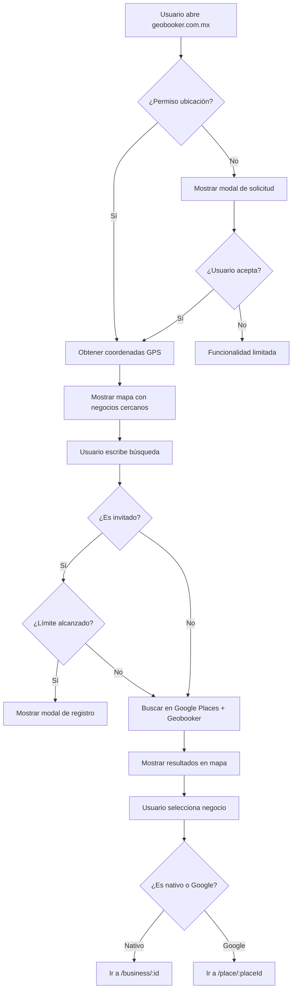
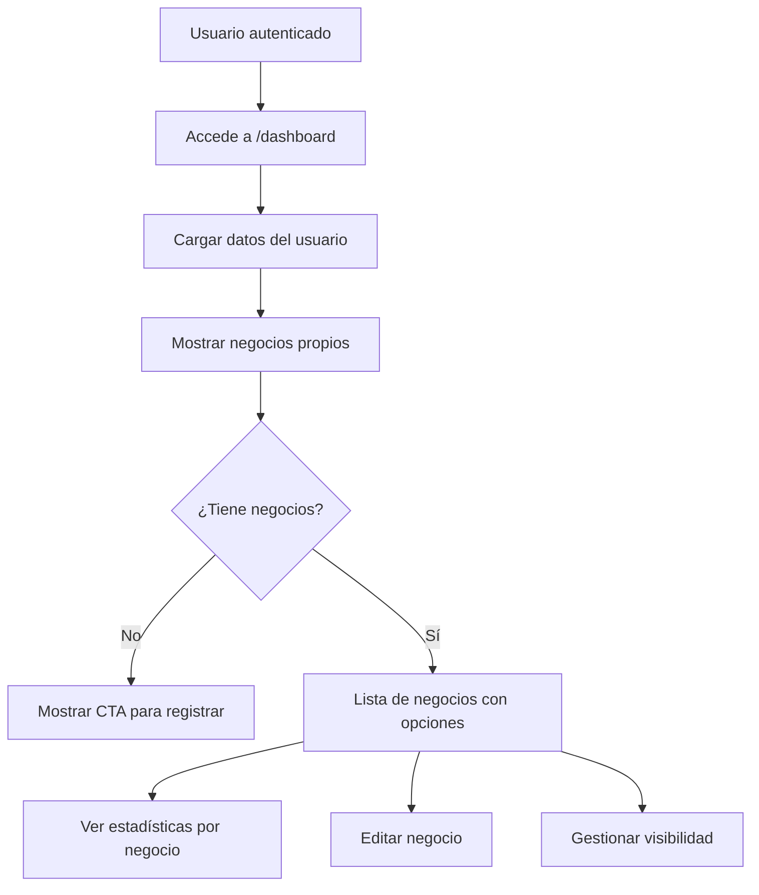
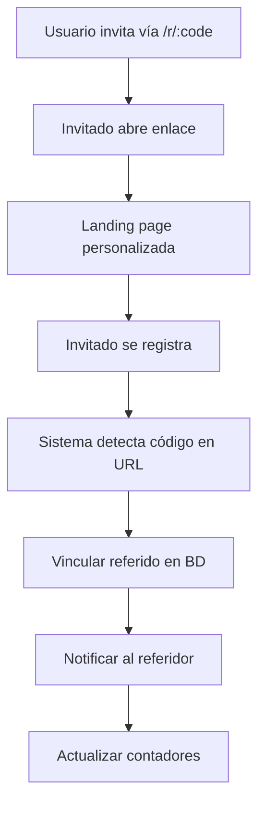
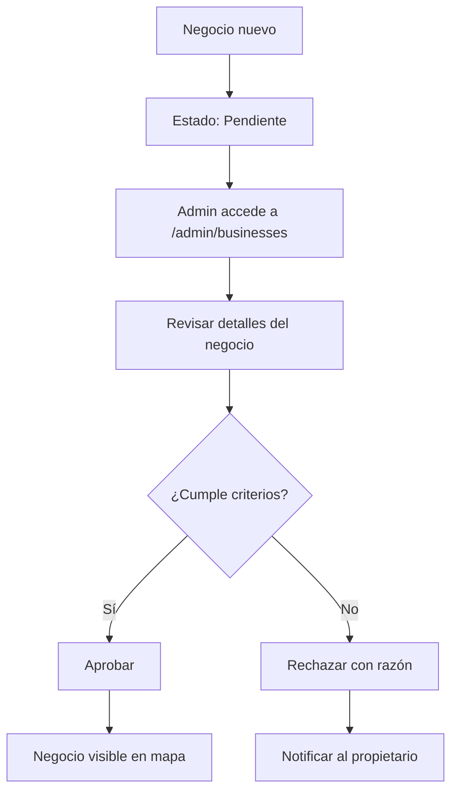
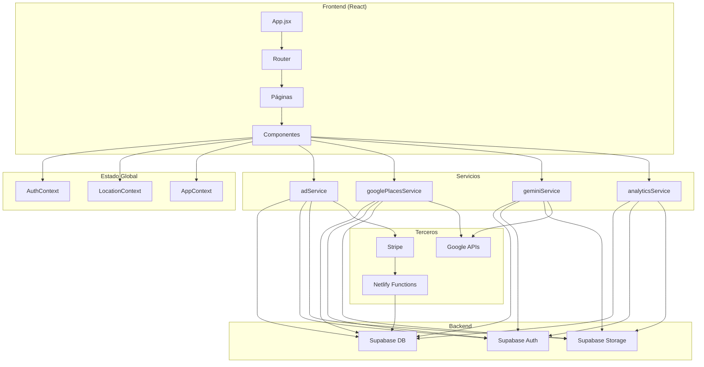
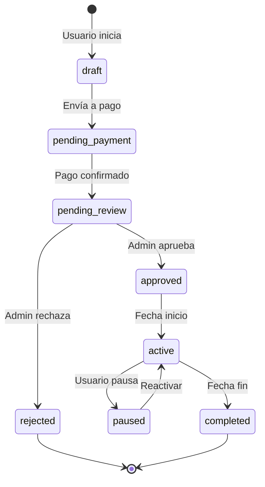
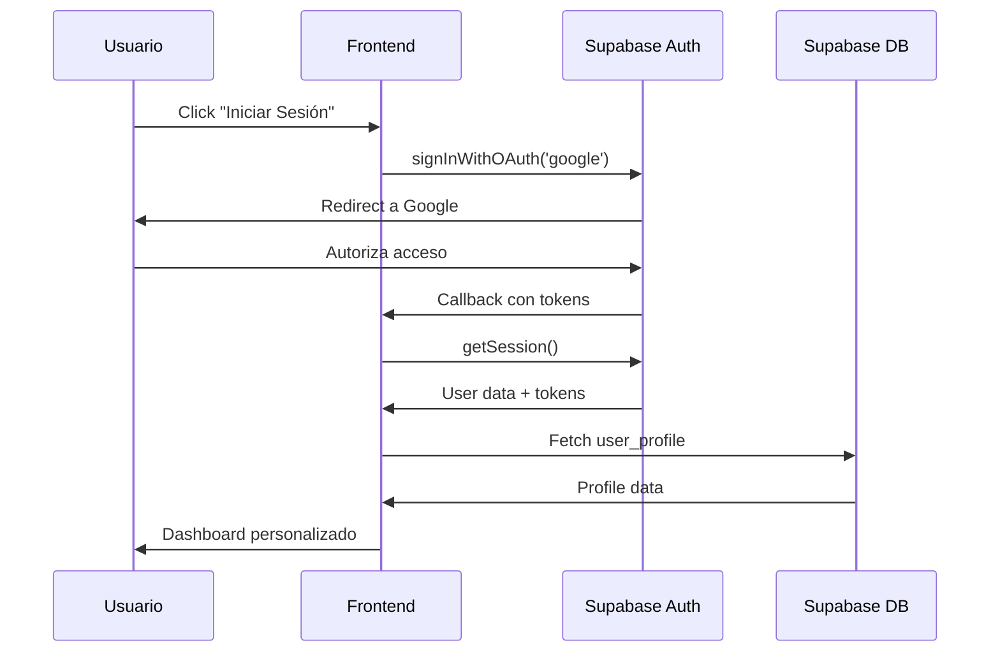

# DOCUMENTO MAESTRO DE PROCESOS Y FLUJOS
## GEOBOOKER - Plataforma de Directorio de Negocios Locales v3.0

**Para uso en: INDAUTOR México y documentación de propiedad intelectual**

**URL de Producción:** https://geobooker.com.mx  
**Fecha de documentación:** 6 de enero de 2026  
**Versión del software:** 3.0.0

---

## ÍNDICE DE CONTENIDOS

1. [Resumen Ejecutivo](#1-resumen-ejecutivo)
2. [Arquitectura General](#2-arquitectura-general)
3. [Flujos de Usuario Público](#3-flujos-de-usuario-público)
4. [Flujos de Usuario Registrado](#4-flujos-de-usuario-registrado)
5. [Flujos del Propietario de Negocio](#5-flujos-del-propietario-de-negocio)
6. [Sistema de Publicidad (Geobooker Ads)](#6-sistema-de-publicidad-geobooker-ads)
7. [Sistema Enterprise (Marcas Globales)](#7-sistema-enterprise-marcas-globales)
8. [Sistema de Referidos](#8-sistema-de-referidos)
9. [Panel de Administración](#9-panel-de-administración)
10. [Servicios Técnicos](#10-servicios-técnicos)
11. [Integraciones de Terceros](#11-integraciones-de-terceros)
12. [Seguridad y Protección de Datos](#12-seguridad-y-protección-de-datos)
13. [Diagramas de Flujo](#13-diagramas-de-flujo)

---

## 1. RESUMEN EJECUTIVO

### ¿Qué es Geobooker?

Geobooker es una **plataforma web progresiva (PWA)** que funciona como directorio inteligente de negocios locales con capacidades de geolocalización en tiempo real. La plataforma conecta a consumidores con negocios cercanos y ofrece herramientas de monetización tanto para propietarios de negocios como para anunciantes.

### Propuesta de Valor Única

1. **Para Consumidores:** Encontrar negocios verificados cerca de su ubicación con información actualizada
2. **Para Negocios:** Visibilidad gratuita y herramientas Premium para destacar
3. **Para Anunciantes:** Publicidad geolocalizada con slots limitados y métricas claras
4. **Para Marcas Globales:** Presencia Enterprise en mercados locales

### Servicios Adicionales de Geobooker Inc.

Además de la plataforma de directorio de negocios, **Geobooker Inc.** ofrece servicios profesionales de:

#### 🖥️ Desarrollo de Software a la Medida
- Aplicaciones web personalizadas
- Aplicaciones móviles (iOS/Android)
- Progressive Web Apps (PWA)
- Sistemas de gestión empresarial
- Integraciones con APIs y servicios de terceros
- Consultoría tecnológica

#### 📢 Servicios de Publicidad y Marketing Digital
- Diseño y gestión de campañas publicitarias
- Marketing en redes sociales
- Diseño gráfico y branding
- Producción de contenido audiovisual
- Estrategias de posicionamiento digital
- Gestión de presencia en línea

> **Página de cotización:** La plataforma incluye `/desarrollo-apps` (AppDevelopmentPage.jsx) para solicitar cotizaciones de desarrollo de software personalizado.

### Métricas del Sistema

| Métrica | Valor |
|---------|-------|
| Páginas únicas | 56+ |
| Componentes React | 68+ |
| Servicios de negocio | 9 |
| Funciones serverless | 5 |
| Rutas del sistema | 50+ |
| Scripts SQL | 82+ |

---

## 2. ARQUITECTURA GENERAL

### Stack Tecnológico Completo

```
┌─────────────────────────────────────────────────────────────────┐
│                        CLIENTE (Frontend)                        │
│  React 18 + Vite + TailwindCSS + React Router + i18next         │
└─────────────────────────────────────────────────────────────────┘
                              │
                              ▼
┌─────────────────────────────────────────────────────────────────┐
│                      HOSTING (Netlify)                           │
│  CDN Edge + Serverless Functions + Automatic Deploys            │
└─────────────────────────────────────────────────────────────────┘
                              │
              ┌───────────────┼───────────────┐
              ▼               ▼               ▼
┌─────────────────┐ ┌─────────────────┐ ┌─────────────────┐
│   Supabase      │ │   Stripe API    │ │   Google APIs   │
│   (Backend)     │ │   (Pagos)       │ │   (Maps/Places) │
│                 │ │                 │ │                 │
│ • PostgreSQL    │ │ • Checkout      │ │ • Maps JS API   │
│ • Auth          │ │ • Webhooks      │ │ • Places API    │
│ • Storage       │ │ • OXXO Pay      │ │ • Gemini AI     │
│ • Realtime      │ │                 │ │                 │
└─────────────────┘ └─────────────────┘ └─────────────────┘
```

### Estructura de Carpetas del Proyecto

```
geobooker3/
├── src/
│   ├── components/          # 68 componentes organizados
│   │   ├── admin/           # Panel de administración (9)
│   │   ├── ads/             # Sistema publicitario (13)
│   │   ├── agent/           # Chatbot AI (1)
│   │   ├── business/        # Gestión de negocios (2)
│   │   ├── common/          # Reutilizables (7)
│   │   ├── layout/          # Layouts y navegación (11)
│   │   ├── modals/          # Modales (2)
│   │   ├── payment/         # Componentes de pago (3)
│   │   ├── recommendations/ # Sistema de recomendaciones (1)
│   │   └── referral/        # Sistema de referidos (3)
│   ├── pages/               # 56 páginas
│   │   ├── admin/           # Panel admin (19)
│   │   ├── advertiser/      # Dashboard anunciantes (1)
│   │   ├── ad-wizard/       # Wizard de campañas (1)
│   │   ├── enterprise/      # Publicidad global (5)
│   │   └── [30+ páginas públicas]
│   ├── services/            # 9 servicios de negocio
│   ├── contexts/            # 3 contextos globales
│   ├── hooks/               # 7 hooks personalizados
│   ├── locales/             # Internacionalización ES/EN
│   └── router.jsx           # Enrutador principal
├── netlify/functions/       # 5 funciones serverless
├── supabase/                # 82+ scripts SQL
├── public/                  # Assets estáticos + PWA
└── docs/                    # Documentación técnica
```

---

## 3. FLUJOS DE USUARIO PÚBLICO

### 3.1 Flujo de Búsqueda de Negocios



**Rutas involucradas:**
- `/` - HomePage (mapa principal)
- `/categories` - Filtrado por categorías
- `/business/:id` - Perfil de negocio nativo
- `/place/:placeId` - Perfil de negocio de Google Places

**Componentes clave:**
- `HomePage.jsx` (896 líneas)
- `BusinessMap.jsx` (mapa interactivo)
- `SearchBar.jsx` (barra de búsqueda)
- `LocationPermissionModal.jsx`

### 3.2 Flujo de Navegación a Negocio

```mermaid
flowchart LR
    A[Ver perfil de negocio] --> B[Click en "Cómo Llegar"]
    B --> C{¿Plataforma?}
    C -->|iOS| D[Abrir Apple Maps]
    C -->|Android| E[Abrir Google Maps App]
    C -->|Desktop| F[Abrir Google Maps Web]
    D --> G[Registrar evento de navegación]
    E --> G
    F --> G
    G --> H[Actualizar métricas del negocio]
```

**Servicio:** `navigationService.js`

### 3.3 Flujo de Visualización de Categorías

1. Usuario accede a `/categories`
2. Sistema muestra grid de categorías principales
3. Usuario selecciona categoría (ej: "Restaurantes")
4. Sistema filtra negocios por categoría
5. Opcionalmente selecciona subcategoría
6. Redirección a HomePage con filtros aplicados

---

## 4. FLUJOS DE USUARIO REGISTRADO

### 4.1 Flujo de Registro de Usuario

```mermaid
flowchart TD
    A[Click en "Crear Cuenta"] --> B[Ir a /signup]
    B --> C{¿Método de registro?}
    C -->|Email/Password| D[Formulario tradicional]
    C -->|Google OAuth| E[Flujo OAuth Google]
    D --> F[Validar campos]
    F --> G[Crear usuario en Supabase Auth]
    E --> H[Callback /auth/callback]
    H --> G
    G --> I[Crear perfil en user_profiles]
    I --> J[Generar código de referido único]
    J --> K[Redirigir a /welcome]
    K --> L[Mostrar tutorial inicial]
```

**Rutas involucradas:**
- `/signup` - Formulario de registro
- `/login` - Inicio de sesión
- `/auth/callback` - Callback OAuth
- `/welcome` - Página de bienvenida

### 4.2 Flujo de Dashboard de Usuario



**Funcionalidades del Dashboard:**
- Ver negocios registrados
- Estado de aprobación de cada negocio
- Editar información de negocios
- Ver métricas de visitas
- Acceder a upgrade Premium
- Gestionar campañas publicitarias

---

## 5. FLUJOS DEL PROPIETARIO DE NEGOCIO

### 5.1 Flujo de Registro de Negocio

```mermaid
flowchart TD
    A[Usuario autenticado] --> B[Click en "Registrar Negocio"]
    B --> C[Ir a /business/register]
    C --> D{¿Es Premium?}
    D -->|No| E{¿Tiene menos de 2 negocios?}
    E -->|No| F[Mostrar upgrade a Premium]
    E -->|Sí| G[Mostrar formulario]
    D -->|Sí| G
    G --> H[Paso 1: Datos básicos]
    H --> I[Paso 2: Ubicación con mapa]
    I --> J[Paso 3: Horarios]
    J --> K[Paso 4: Categoría/Subcategoría]
    K --> L[Paso 5: Fotos opcional]
    L --> M[Enviar para revisión]
    M --> N[Estado: Pendiente]
    N --> O[Admin revisa]
    O --> P{¿Aprobado?}
    P -->|Sí| Q[Visible en mapa]
    P -->|No| R[Rechazado con razón]
```

**Campos del formulario:**
- Nombre del negocio
- Descripción
- Teléfono/WhatsApp
- Dirección
- Coordenadas (selección en mapa)
- Horarios de operación
- Categoría principal
- Subcategoría
- Fotos (hasta 5)
- Links de redes sociales

### 5.2 Flujo de Edición de Negocio

1. Acceder a `/dashboard`
2. Seleccionar negocio a editar
3. Ir a `/dashboard/business/:id/edit`
4. Modificar campos deseados
5. Guardar cambios
6. Los cambios son inmediatos (sin re-aprobación)

### 5.3 Flujo de Visibilidad del Negocio

El propietario puede:
- **Ocultar temporalmente** su negocio (vacaciones, renovación)
- **Mostrar** nuevamente cuando esté operativo
- Campo: `is_visible` en tabla `businesses`

---

## 6. SISTEMA DE PUBLICIDAD (GEOBOOKER ADS)

### 6.1 Tipos de Espacios Publicitarios

| Espacio | Descripción | Precio MXN/mes | Ubicación |
|---------|-------------|----------------|-----------|
| **Hero Banner** | Banner principal animado | $2,500 | Página principal, arriba del mapa |
| **Carousel Destacado** | Tarjeta en carrusel | $1,500 | Sección "Negocios Destacados" |
| **Recomendados** | Sección lateral | $800 | Sidebar de resultados |
| **Resultado Patrocinado** | Primer resultado de búsqueda | $1,200 | Lista de resultados |
| **Fullwidth** | Banner ancho completo | $1,800 | Entre secciones |
| **Sticky Banner** | Banner fijo inferior | $600 | Footer persistente |

> **Nota:** Todos los precios son + IVA (16%)

### 6.2 Flujo de Creación de Campaña

```mermaid
flowchart TD
    A[Usuario ve /advertise] --> B[Selecciona espacio publicitario]
    B --> C[Click "Crear Campaña"]
    C --> D{¿Autenticado?}
    D -->|No| E[Redirigir a /login]
    D -->|Sí| F[Ir a /advertise/create]
    F --> G[Wizard Paso 1: Tipo de espacio]
    G --> H[Wizard Paso 2: Creativos]
    H --> I[Subir imagen]
    I --> J[Escribir headline y CTA]
    J --> K[Wizard Paso 3: Duración]
    K --> L[Seleccionar fechas]
    L --> M[Wizard Paso 4: Pago]
    M --> N{¿Método de pago?}
    N -->|Tarjeta| O[Stripe Checkout]
    N -->|OXXO| P[Generar voucher OXXO]
    O --> Q[Confirmar pago]
    P --> R[Esperar confirmación]
    Q --> S[Campaña en estado: Pendiente Revisión]
    R --> S
    S --> T[Admin revisa creativos]
    T --> U{¿Aprobado?}
    U -->|Sí| V[Programar campaña]
    U -->|No| W[Rechazar con razón]
    V --> X[Campaña activa en fecha inicio]
```

**Componente principal:** `CampaignCreateWizard.jsx`

### 6.3 Estados de una Campaña

| Estado | Descripción |
|--------|-------------|
| `draft` | En proceso de creación |
| `pending_payment` | Esperando pago |
| `pending_review` | Pagada, esperando aprobación |
| `approved` | Aprobada, programada |
| `active` | Actualmente visible |
| `paused` | Pausada por usuario/admin |
| `completed` | Finalizada |
| `rejected` | Rechazada |

### 6.4 Sistema de Tracking de Anuncios

Cada anuncio registra:
- **Impresiones:** Cada vez que el anuncio se muestra
- **Clics:** Cada interacción del usuario
- **CTR:** Click-Through Rate calculado
- **Ubicación:** Dónde se mostró (página, posición)

**Servicio:** `adService.js`

---

## 7. SISTEMA ENTERPRISE (MARCAS GLOBALES)

### 7.1 Descripción

El sistema Enterprise está diseñado para **marcas internacionales** que desean presencia publicitaria premium en Geobooker con:

- Precios en **USD**
- Duración mínima: **12 meses**
- Atención personalizada
- Creativos premium
- Reportes ejecutivos

### 7.2 Flujo Enterprise

```mermaid
flowchart TD
    A[Marca accede a /enterprise] --> B[Ver catálogo Enterprise]
    B --> C[Seleccionar paquete]
    C --> D[Ir a /enterprise/contact]
    D --> E[Llenar formulario de contacto]
    E --> F[Enviar solicitud]
    F --> G[Admin recibe notificación]
    G --> H[Reunión comercial]
    H --> I{¿Acuerdo?}
    I -->|Sí| J[Generar checkout personalizado]
    J --> K[/enterprise/checkout]
    K --> L[Pago vía Stripe]
    L --> M[/enterprise/success]
    M --> N[Activar campaña Enterprise]
```

**Rutas Enterprise:**
- `/enterprise` - Landing page
- `/enterprise/contact` - Formulario de contacto
- `/enterprise/checkout` - Pago personalizado
- `/enterprise/success` - Confirmación
- `/enterprise/edit/:id` - Edición de campañas

---

## 8. SISTEMA DE REFERIDOS

### 8.1 Mecánica del Sistema

Cada usuario registrado recibe un **código de referido único** que puede compartir. Cuando alguien se registra usando ese código:

1. El nuevo usuario obtiene beneficios de bienvenida
2. El referidor acumula puntos/recompensas
3. Se crea registro en tabla de referidos

### 8.2 Flujo de Referido



**Componentes:**
- `ReferralLanding.jsx` - Página de aterrizaje
- `InviteButton.jsx` - Botón de compartir
- `ChristmasPromoModal.jsx` - Promociones temporales

---

## 9. PANEL DE ADMINISTRACIÓN

### 9.1 Acceso y Autenticación

- **Ruta:** `/admin/login`
- **Verificación:** Campo `is_admin` en `admin_users`
- **Layout:** `AdminDashboardLayout.jsx`

### 9.2 Módulos del Admin

| Módulo | Ruta | Función |
|--------|------|---------|
| Dashboard | `/admin/dashboard` | Métricas generales |
| Negocios | `/admin/businesses` | Aprobar/rechazar negocios |
| Usuarios | `/admin/users` | Gestión de usuarios |
| Anuncios | `/admin/ads` | Gestión de campañas |
| QA Tool | `/admin/ads-qa` | Testing de publicidad |
| Reportes | `/admin/reports` | Reportes de negocios |
| Ad Reports | `/admin/ad-reports` | Reportes de anuncios |
| Analytics | `/admin/analytics` | Estadísticas GA4 |
| Revenue | `/admin/revenue` | Ingresos y finanzas |
| Inventario | `/admin/inventory` | Slots publicitarios |
| Blog | `/admin/blog` | Gestión de contenido |
| Scan Invite | `/admin/scan-invite` | Escanear códigos QR |
| Settings | `/admin/settings` | Configuración |

### 9.3 Flujo de Aprobación de Negocios



### 9.4 Flujo de Moderación de Anuncios

1. Campaña pagada llega a estado `pending_review`
2. Admin accede a `/admin/ads`
3. Revisa creativos (imagen, texto, URL)
4. Verifica cumplimiento de políticas
5. Aprueba o rechaza con comentarios
6. Si aprueba, la campaña se activa en la fecha programada

---

## 10. SERVICIOS TÉCNICOS

### 10.1 Servicios de Negocio (9 archivos)

| Servicio | Archivo | Responsabilidad |
|----------|---------|-----------------|
| **Publicidad** | `adService.js` | CRUD de campañas, creativos, tracking |
| **Analytics** | `analyticsService.js` | Integración con GA4, eventos personalizados |
| **Caché Negocios** | `businessCacheService.js` | IndexedDB para caché offline |
| **Negocios** | `businessService.js` | Operaciones CRUD de negocios |
| **Versión Caché** | `cacheVersionService.js` | Control de versiones de caché |
| **AI/Chatbot** | `geminiService.js` | Integración con Google Gemini |
| **Google Places** | `googlePlacesService.js` | Búsqueda y caché de Places API |
| **Navegación** | `navigationService.js` | Tracking de rutas a negocios |
| **Reportes** | `reportService.js` | Generación de reportes PDF |

### 10.2 Funciones Serverless (Netlify Functions)

| Función | Archivo | Propósito |
|---------|---------|-----------|
| **Checkout** | `create-checkout-session.js` | Crear sesión de pago Stripe |
| **OXXO** | `create-oxxo-payment.js` | Generar voucher OXXO |
| **Webhook** | `stripe-webhook.js` | Procesar eventos de Stripe |
| **Notificación** | `notify-admin-campaign.js` | Notificar admin de nuevas campañas |
| **Test** | `test-function.js` | Testing de funciones |

### 10.3 Contextos Globales (React Context)

| Contexto | Propósito |
|----------|-----------|
| `AuthContext` | Estado de autenticación del usuario |
| `AppContext` | Estado global de la aplicación |
| `LocationContext` | Ubicación GPS del usuario |

### 10.4 Hooks Personalizados (7)

| Hook | Propósito |
|------|-----------|
| `useSessionTimeout` | Manejo de expiración de sesión |
| `useGuestSearchLimit` | Límite de búsquedas para invitados |
| `useInterstitialTrigger` | Trigger de anuncios interstitial |
| Y otros... | Funcionalidades específicas |

---

## 11. INTEGRACIONES DE TERCEROS

### 11.1 Google APIs

| API | Uso | Clave requerida |
|-----|-----|-----------------|
| **Maps JavaScript API** | Visualización del mapa | `VITE_GOOGLE_MAPS_API_KEY` |
| **Places API** | Búsqueda de negocios externos | Misma clave |
| **Gemini AI** | Chatbot inteligente | `VITE_GEMINI_API_KEY` |

### 11.2 Supabase

| Servicio | Uso |
|----------|-----|
| **Auth** | Autenticación de usuarios |
| **Database** | PostgreSQL para datos |
| **Storage** | Almacenamiento de imágenes |
| **Realtime** | Actualizaciones en tiempo real |
| **Edge Functions** | Funciones serverless (futuro) |

### 11.3 Stripe

| Endpoint | Uso |
|----------|-----|
| **Checkout Sessions** | Pagos con tarjeta |
| **OXXO Pay** | Pagos en efectivo (México) |
| **Webhooks** | Confirmación de pagos |
| **Customer Portal** | Gestión de suscripciones |

### 11.4 Netlify

| Servicio | Uso |
|----------|-----|
| **Hosting** | Alojamiento del sitio |
| **Functions** | Backend serverless |
| **Edge CDN** | Distribución global |
| **Forms** | Procesamiento de formularios |
| **Analytics** | Métricas de uso |

---

## 12. SEGURIDAD Y PROTECCIÓN DE DATOS

### 12.1 Autenticación

- **Supabase Auth** para gestión de usuarios
- **OAuth 2.0** con Google
- **JWT tokens** para sesiones
- **Row Level Security (RLS)** en todas las tablas
- **Refresh tokens** automáticos

### 12.2 Políticas RLS (Row Level Security)

Cada tabla tiene políticas que restringen:
- **SELECT:** Quién puede leer datos
- **INSERT:** Quién puede crear registros
- **UPDATE:** Quién puede modificar (solo propietarios)
- **DELETE:** Quién puede eliminar (solo admins)

### 12.3 Protección del Chatbot AI

El asistente virtual tiene **reglas estrictas** que prohíben revelar:
- Arquitectura técnica
- Tecnologías utilizadas
- Datos de usuarios o anunciantes
- Información financiera
- APIs o credenciales
- Métricas internas

### 12.4 Variables de Entorno

Todas las credenciales sensibles están en:
- `VITE_SUPABASE_URL`
- `VITE_SUPABASE_ANON_KEY`
- `VITE_STRIPE_PUBLISHABLE_KEY`
- `STRIPE_SECRET_KEY` (solo en Netlify)
- `STRIPE_WEBHOOK_SECRET`
- `VITE_GOOGLE_MAPS_API_KEY`
- `VITE_GEMINI_API_KEY`

---

## 13. DIAGRAMAS DE FLUJO

### 13.1 Arquitectura de Alto Nivel



### 13.2 Ciclo de Vida de una Campaña Publicitaria



### 13.3 Flujo de Autenticación



---

## ANEXOS RECOMENDADOS PARA INDAUTOR

1. **Anexo A:** Este documento completo impreso
2. **Anexo B:** Impresión del código fuente (carpeta /src)
3. **Anexo C:** Capturas de pantalla de todas las páginas
4. **Anexo D:** Diagrama ER de la base de datos
5. **Anexo E:** Bitácora de desarrollo (git log --oneline)
6. **Anexo F:** Certificado de dominio geobooker.com.mx
7. **Anexo G:** Registro de marca "Geobooker" (si aplica)

---

## DECLARACIÓN DE ORIGINALIDAD

Este documento describe una obra original de software desarrollada íntegramente por el titular de los derechos. Todo el código fuente, diseño de interfaces, arquitectura de sistemas, algoritmos propietarios y lógica de negocio descritos son creación original.

Las únicas excepciones son las librerías de terceros debidamente identificadas (React, TailwindCSS, etc.) utilizadas bajo licencias open source compatibles (MIT, ISC).

**Fecha de generación:** 6 de enero de 2026  
**Versión del documento:** 1.0

---

*Documento generado para uso exclusivo en trámites de registro de propiedad intelectual ante INDAUTOR y organismos equivalentes.*
