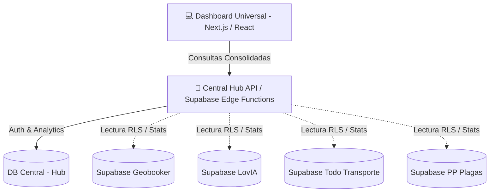

# 🌐 Ecosistema Geobooker INC — Plan de Dashboard Universal & Publicidad Cruzada
**Fecha del Plan:** 09 de junio de 2026  
**Documento de Respaldo Estratégico**  
**Versión:** 1.0 (Borrador Arquitectónico)

---

## 🎯 1. Visión General del Proyecto
A medida que el ecosistema de **Grupo Geobooker** se expande con verticales especializadas (Geobooker.com.mx, LovIA, Todo Transporte "TT", PP Plagas, etc.), la gestión individualizada se vuelve ineficiente.

El **Dashboard Universal (Consola Hub Admin)** será la casa matriz tecnológica y comercial de control. Un único panel web que permitirá al administrador gestionar:
1.  **Ingresos Consolidados:** Suscripciones Stripe y comisiones de pasarelas de todas las aplicaciones.
2.  **Publicidad Cruzada (Shared Ads):** Creación de campañas publicitarias dinámicas que se muestran de forma inteligente en múltiples plataformas con base en geolocalización.
3.  **Auditoría y Seguridad:** Moderación de perfiles, resolución de disputas de usuarios y tickets de soporte unificados.

---

## 🏗️ 2. Arquitectura de Integración de Datos
Dado que cada aplicación corre sobre su propia base de datos Supabase para mantener el aislamiento y la velocidad de desarrollo, el Dashboard Universal utilizará un modelo de **Federación de Datos**:



### Tecnologías de Integración Sugeridas
1.  **Supabase Foreign Data Wrappers (FDW):** Permite a la base de datos central de Geobooker realizar consultas de solo lectura directas a las tablas de `providers`, `payments` y `profiles` de los otros Supabase mediante el wrapper oficial de Postgres wrapper.
2.  **Servicios de Agregación Serverless:** Un backend centralizado (utilizando Edge Functions o API routes de Next.js) con claves de servicio seguras (`Service Role Keys`) que consultan asíncronamente las métricas de rendimiento y facturación de todas las bases de datos del grupo.

---

## 📣 3. Estrategia de Publicidad Cruzada (Shared Ads)
La publicidad cruzada aumentará el ticket promedio de los anunciantes al ofrecerles presencia en múltiples portales mediante compras unificadas.

### Modelo de Datos de Publicidad Centralizada
La tabla de anuncios (`ads`) en el Hub contará con la siguiente estructura:
```sql
CREATE TABLE public.central_campaigns (
  id                  UUID PRIMARY KEY DEFAULT gen_random_uuid(),
  advertiser_id       UUID NOT NULL, -- Perfil en base central
  title               TEXT NOT NULL,
  banner_url          TEXT NOT NULL,
  target_url          TEXT,
  
  -- Segmentación Cruzada
  target_platforms    TEXT[] DEFAULT '{geobooker, tt}', -- LovIA, TT, PP Plagas, etc.
  target_cities       TEXT[], -- Ej: {'Querétaro', 'Monterrey'}
  target_categories   TEXT[], -- Ej: {'Talleres', 'Llantas', 'Servicios Industriales'}
  
  -- Presupuesto y Métricas
  budget              NUMERIC(10,2) NOT NULL,
  spent               NUMERIC(10,2) DEFAULT 0.00,
  clicks              INTEGER DEFAULT 0,
  impressions         INTEGER DEFAULT 0,
  status              TEXT DEFAULT 'paused' CHECK (status IN ('active', 'paused', 'completed')),
  
  created_at          TIMESTAMPTZ DEFAULT NOW()
);
```

### Paquetes Publicitarios Inteligentes
*   **Paquete B2B Logístico ($3,499 MXN/mes):** El banner se despliega simultáneamente en la categoría "Talleres" de Geobooker.com.mx y en todo el mapa de Todo Transporte.
*   **Paquete Ecosistema Completo ($5,999 MXN/mes):** Visualización masiva en la Home de Geobooker, en sugerencias comerciales de LovIA (ej: "Lugares para citas" -> restaurantes patrocinados) y en la barra lateral de Todo Transporte.

---

## 💳 4. Gestión de Ingresos Consolidados
El panel financiero unificará las cuentas de Stripe conectadas y el cobro de comisiones del marketplace.

*   **Suscripciones SaaS:** Monitoreo del flujo de caja de los proveedores Premium (Geobooker + TT + PP Plagas).
*   **Comisión por Transacción (Fee de Servicio):** El 10% cobrado por la intermediación en rentas de bodegas temporales (TT Storage) y servicios ejecutados en las plataformas.
*   **Facturación Centralizada:** Unificación de los datos de facturación de las empresas anunciantes, permitiendo emitir una sola factura del grupo por servicios de publicidad multipantalla.

---

## 🔒 5. SSO (Single Sign-On) para el Administrador
Para garantizar que el administrador entre a Geobooker, LovIA y TT con el **mismo usuario y contraseña**:
*   En la fase actual, el administrador se registra en el Supabase local de cada app y se le actualiza su rol a `admin` en la base de datos respectiva.
*   A futuro, se implementará un servicio de autenticación federada (OAuth propio o Supabase Auth unificado en el dominio primario `geobooker.com.mx`) para que una vez iniciada sesión en el Hub, el token JWT sea válido para navegar en las consolas de administración de todas las verticales de manera transparente.
